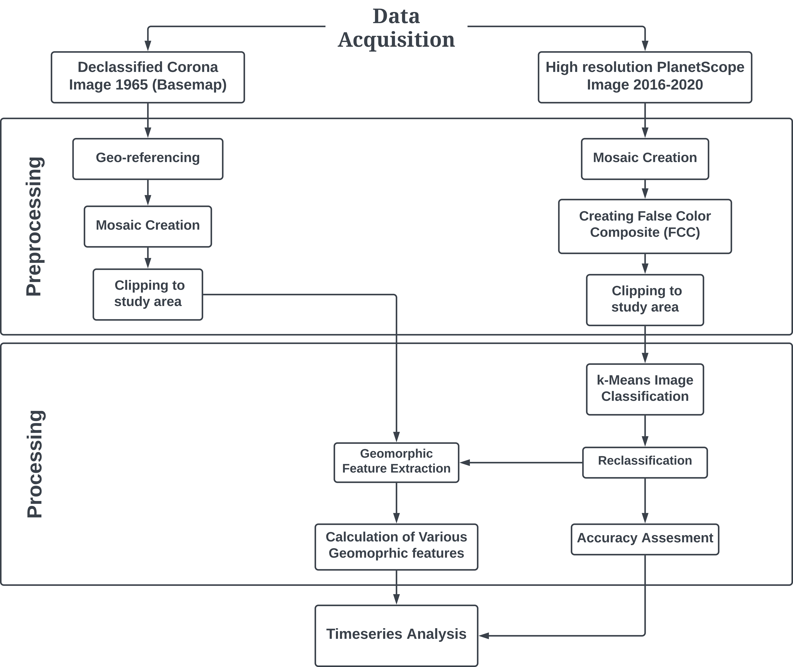

# Impact of Sand Mining on the Morphology of the Yamuna River

## A Remote Sensing and Machine Learning Approach

  
This repository contains the code and resources for the project "Impact of Sand Mining on the Morphology of the Yamuna River," which was the subject of my Master's thesis at the Indian Institute of Science Education and Research Bhopal.

This project investigates the impact of sand mining on the morphology of the Yamuna River using remote sensing techniques and machine learning. The study focuses on a 36 km stretch of the river from Hathnikund Barrage to the Old Delhi Bridge, an area that has seen a rise in reported sand mining activities.

### Abstract

The world consumes 40 to 50 billion tonnes of sand and aggregates annually, making it the second most mined commodity globally. The natural replenishment rate of sand in rivers, however, is only about 19 billion tonnes. This significant gap has led to unsustainable and often illegal sand mining, especially in developing countries like India. This study utilizes remote sensing and machine learning to analyze the geomorphological changes in the Yamuna River from 2016 to 2020. By leveraging high-resolution PlanetScope satellite imagery, we assess the spatiotemporal changes in key geomorphic features like bar density, river width, and sinuosity. The findings provide a quantitative assessment of the river's morphological response to sand mining and demonstrate the potential of remote sensing as a cost-effective tool for monitoring such activities.

### Key Features

* **Temporal Analysis**: The project analyzes satellite imagery from 2016 to 2020, covering pre-monsoon, monsoon, and post-monsoon seasons.
* **High-Resolution Imagery**: Utilizes 3-meter resolution PlanetScope imagery for detailed analysis.
* **Machine Learning**: Employs unsupervised k-means clustering for the classification of geomorphic features.
* **Geomorphic Feature Extraction**: Calculates and analyzes changes in bar density, river width, and sinuosity.
* **Historical Comparison**: Compares recent changes with historical data from 1965 using declassified CORONA satellite imagery.

### Methodology

The methodology for this project can be summarized in the following steps:

1.  **Data Acquisition**:
    * Historical data: Declassified CORONA satellite images from 1965 (2m resolution).
    * Recent data: PlanetScope optical images from 2016 to 2020 (3m resolution).
2.  **Data Preprocessing**:
    * Georeferencing of CORONA images using a 3rd order polynomial transformation.
    * Creation of False Color Composites (FCC) from PlanetScope imagery to differentiate water bodies, vegetation, and sand deposits.
    * Mosaicking and clipping of images to the study area.
3.  **Image Classification**:
    * Application of unsupervised k-means clustering to classify the images into 18 classes.
    * Reclassification of the 18 classes into three main categories: water body, exposed deposited areas, and vegetation.
4.  **Feature Extraction and Analysis**:
    * Vectorization of raster data to extract geomorphic features.
    * Calculation of Sinuosity, River Width, and Bar Density for each of the 9 reaches of the study area.

 

### Results

The study revealed significant morphological changes in the Yamuna River over the study period:

* **Sinuosity**: Increased meandering was observed in the lower reaches of the river, with the highest sinuosity values seen in Reach 7.
* **River Width**: The river channel widened during the monsoon and narrowed during the pre- and post-monsoon seasons. The year 2020 showed a different trend with a decrease in width from pre-monsoon to monsoon.
* **Bar Density**: The highest deposition of sand bars was observed during the pre-monsoon and post-monsoon periods, especially in the upper reaches. A decrease in bar density in the pre-monsoon period suggests that mining activities are a contributing factor.

The overall accuracy of the classification model ranged from 61% to 92%, demonstrating the effectiveness of the approach, especially with low cloud cover.

 

### How to Use

The Google Earth Engine script used for this project is available in the folders. You can load this script into your Google Earth Engine account to replicate the analysis. But remember to change the `Map.centerObject` coordinates to your area of interest and you have to ingest the PlanetScope images into your GEE account.

### Future Work

This study can be further improved by:

* **Incorporating Field Data**: Integrating field-acquired data can help in validating the results and improving the accuracy of the analysis.
* **Using Higher Resolution Imagery**: Utilizing data from drones and UAVs can provide even more detailed insights.
* **Volumetric Analysis**: Incorporating height data from LiDAR or SAR can enable the calculation of the volume of sand extracted, providing a more comprehensive assessment of the mining impact.
* **SAR Data Integration**: Using SAR data can allow for monitoring during both day and night and in all weather conditions.

### Acknowledgments

I would like to express my sincere gratitude to my supervisors, Dr. Kumar Gaurav and Dr. Christopher R. Hackney, for their invaluable guidance and support throughout this project[cite: 51]. I would also like to thank my thesis committee members and the students of the Fluvial Geomorphology and Remote Sensing Lab for their insightful comments and encouragement.

### Contact

For any questions or collaborations, please feel free to reach out:

* **Name**: Sohan Nag
* **LinkedIn**: www.linkedin.com/in/sohan23
* **GitHub**: https://github.com/sohan23/
